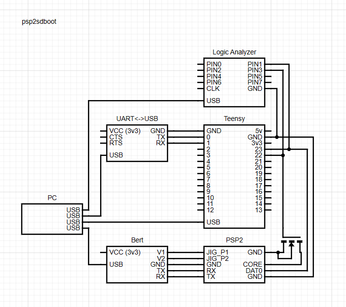
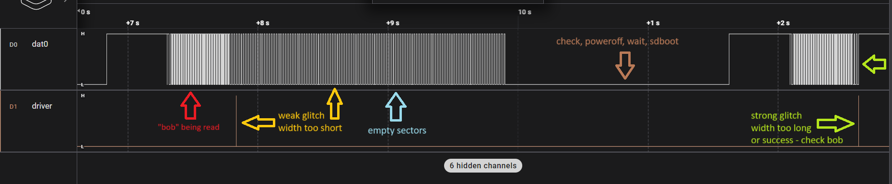
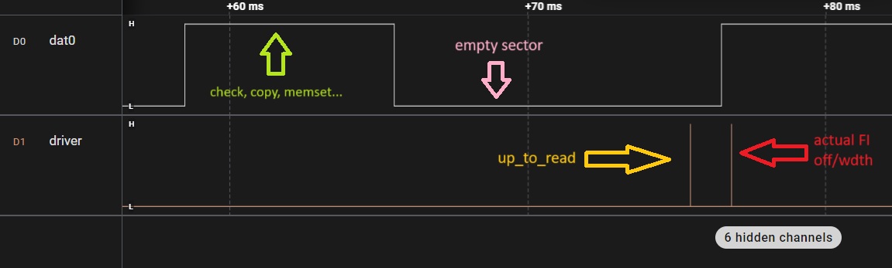
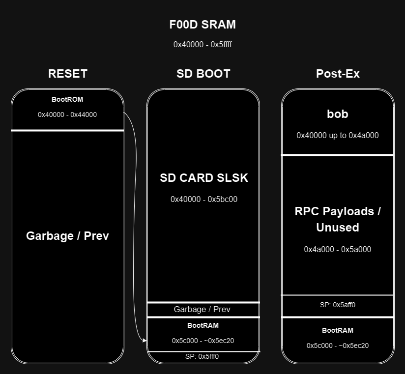

# psp2sdboot
This repo contains guides, payloads, schematics and scripts for use with PSP2's "SD boot mode".<br>
<br>
## About
#### JIG
On all Playstation Vita/TV units the System Controller ("syscon", "ernie") has an RPC server activated by a specific hardware circuit. When activated, syscon listens over UART for commands that can range from simple diag checks, fuse reads, calibrations, to special features such as NVS R/W that require authorization using handshakes with secret keys. More information as well as circuit schematics and RPC clients can be found in the [bert](https://github.com/SKGleba/bert) repository.
#### GC/SD boot
An authorized JIG interface client can trigger a special, alternative boot mode inside the BootROM. In this mode, which we dubbed "sdboot", a signed second_loader.enp is loaded from an unauthenticated MMC/SD storage inside the GameCard slot and decrypted using an alternative set of per-console keys.<br>
#### Vulnerability
In sdboot, after copying itself from 0x40000 to 0x5c000, BootROM first reads a single block (0x200 bytes) from the external storage to 0x40000, verifies if second_loader offset and size fields are valid, then reads second_loader to 0x40000.<br>
The issue is that the exception vectors are hardcoded to 0x40000, so any exceptions in BootROM during (or after) second_loader is read will cause a "jump" to the read data - resulting in arbitrary code execution.
#### Code execution
A simple way to trigger an exception is to perform a Fault Injection attack. Because all faults/exceptions result in code execution, the FI setup does not need to be precise, and can be approached in a spray-and-pray manner.<br>
This project makes use of Voltage Fault Injection, specifically the "crowbar" method, performed by a low cost setup with the Teensy 4 mcu system at heart.<br>
The result is a consistent BootROM code execution of a arbitrary code blob loaded from an unauthenticated MMC/SD storage inside the GameCard slot.
#### BootROM RPC
With psp2sdboot, the default code blob is [bob](https://github.com/SKGleba/bob), it starts an RPC server that can be used for research or executing additional specialized payloads with functionality such as key retrieval, data dumping, unbricking and more.
#### Supported units
 - DEM-3000 : **only IRT-002**
   - Due to an unknown JIG interface-enable procedure on IRT-001 / "slideys"
 - CEM-3000 : **supported**
 - PCH-1000 : **supported**
 - VTE-1000 : **supported**
 - PCH-2000 : **not yet supported**
   - Due to lack of success triggering exceptions with Voltage Fault Injection
<br><br>
## Setup
### Requirements
 - a working [syscon JIG setup](https://github.com/SKGleba/bert)
 - logic analyzer with at least two channels, a simple USB 8ch saleae/clone should work
 - GC-SD adapter such as ["sd2vita"](https://www.bing.com/search?q=sd2vita), with a micro/sd up to 2TiB
 - consistent, configurable pulse generator that can set 1v+ for 100ns or less.
    - for this project, the [Teensy 4.0](https://www.pjrc.com/store/teensy40.html) / [Teensy 4.1](https://www.pjrc.com/store/teensy41.html) mcu board was chosen for its high speed, tight-coupled memory and gpio controllers
    - a [chipwhisperer](https://www.newae.com/chipwhisperer) (lite) was also successfully used in this project's early iterations
 - fast switching, logic level n-mosfet
    - depending on your soldering skills/setup, a breakout board might be a good idea
    - for this project, [IRLML2502](https://www.infineon.com/cms/en/product/power/mosfet/n-channel/irlml2502/) and [IRLML6246](https://www.infineon.com/cms/en/product/power/mosfet/n-channel/irlml6246/) were used
 - 3.3v usb<->uart adapter for communicating with the Teensy 4 mcu board
### Teensy
 - Connect the Teensy 4 to a PC, enter bootloader mode
 - Flash the latest build of [teensy4vfi](https://github.com/SKGleba/teensy4vfi) using [Teensy Loader](https://www.pjrc.com/teensy/loader.html)
 - Connect the usb<->uart adapter
    - PC TX -> Teensy pad 0 (RX)
    - PC RX -> Teensy pad 1 (TX)
    - GND
### Solder points
There are at least two (magnet) wire solder points - Core_VDD (orange) and GC_dat0 (yellow).
 - PCH-1000/PDEL-1000/CEM-3000/DEM-3000: [front](wiring/wires-pch1k.png)
 - VTE-1000: [front](wiring/wires-vte-front.png) | [back](wiring/wires-vte-back.png)
 - It is recommended to add a separate GND wire for the MOSFET.
### Wiring
The MOSFET wires should be insulated and kept as short as possible, you can even solder its legs directly to the Core_VDD capacitor.<br><br>

### Software
The original setup was Windows + WSL1, but the instructions should work fine on Windows, Linux and MacOS.
#### Prerequisites
 - Python 3.10+
    - + pyserial, pycryptodome
 - GCC
 - [Saleae Logic](https://www.saleae.com/downloads/)
    - or whatever software your Logic Analyzer uses
 - local copies of [psp2sdboot](https://github.com/SKGleba/psp2sdboot), [teensy4vfi](https://github.com/SKGleba/teensy4vfi), [bob](https://github.com/SKGleba/bob), and [bert](https://github.com/SKGleba/bert)
 - (optional) [mepsdk](https://github.com/TeamMolecule/mepsdk)
#### Environment
The "root", working directory should be a local copy of this repository.
 - compile ```tools/mkfake.c``` with GCC
 - create symlinks for ```bob/bob_rpc.py```, ```teensy4vfi/teensy_rpc.py```, and ```bert/bert.py```
 - create a ```bob``` directory in ```payloads/```, and copy there the bob build and header files
    - ```bob/build/*``` to ```payloads/bob/```
    - ```bob/source/include``` to ```payloads/bob/```
 - "set" the environment by running the provided ```env.bat```
    - this simply sets a bunch of aliases
### microSD card
A raw SD card image can be created using the previously compiled mkfake utility, the syntax is ```mkfake <code_blob> -o <output>``` where:
 - *code_blob* is bob's glitch build - ```payloads/bob/bob_glitch.bin```
 - *output* will be the SD card image
The prepared SD card must then be inserted in the target's GC slot.
<br><br>
## SD Boot
The provided *sdboot.py* is a python script that loops reboot->glitch->check until *bob* is successfully loaded and executed. <br>
Its accepted arguments/parameters and their descriptions can be listed with ```sdboot help```.
### Calibration
The first step is determining optimal timing parameters range for the main sdboot script, which will then find the more precise/consistent glitch timings.
#### The "threshold" width
The *width* of a glitch that always causes an unrecoverable crash is called the "threshold", this should be the upper *width* boundary - sdboot's *width_max* argument.<br>
It can be determined by the following procedure:
1. ```sdboot width=100 width_max=100000 width_step=100```
   - note the *width* at which *dat0* cut off
   - if there is no *dat0* cut off until 100000, the setup is wrong/faulty
2. ```sdboot width=<cutoff_width-100> width_max=<cutoff_width+100> width_step=20```
   - repeat at least 5 times
   - note the *width* at which *dat0* __always__ cuts off, this is the "threshold"
3. If the "threshold" is below 200, it might indicate a faulty circuit, slow mosfet, or a very isolated/clean setup.<br><br>

#### The "*up_to_read*" offset
*up_to_read* is a special 0-width glitch queued to find an empty sector read op, which compensates for a high SD init/read jitter.<br>
The idea is that as long as it lands in the middle of an empty sector being read (*dat0* pulled down), the actual fault injection glitch can be precisely triggered and timed from *dat0* going up.<br>
It can be determined by altering the following command: ```sdboot up_to_read_mark=100 up_to_read=298400000```. Change *up_to_read* until the *mosfet* line spike happens around the middle of an empty sector read.<br><br>

### Glitching
The second step is running the sdboot python script, and letting it find a correct combination of *offset* and *width* parameters <br>
Script arguments are based on the values found during the Calibration step, with an added broad *offset* range:<br>
```sdboot up_to_read=<up_to_read> width=<threshold-(2*width_step)> width_max=<threshold+width_step> width_step=20 offset=100 offset_max=10000 offset_mult=10 offset_step=40```
 - *offset** parameters should initially be broad, with further loops being more precise (eg *offset_mult=1*)
 - if the threshold is below 500, *width_step*=10 might be a better choice
 - if the starting *width* (threshold - (2 x *width_step*)) is observed to cut off dat0, the starting *width* should be decreased by *width_step*-sized decrements
 - ultimately it depends on luck, it might take hours or even days to find a working *offset* and *width* pair
 - in case of success, a ```got sd boot: off=<offset>[<offset_mult>] width=<width>``` message will be displayed and the script will stop
<br><br>
## Post-Exploitation
After bob presence is confirmed with ```bob ping```, you can use the bob_rpc script to conduct further research or copy and run MeP payloads. Available RPC commands can be listed by calling the script without any arguments - ```bob```.

### RPC payloads
You should put your custom payloads inside the ```payloads/``` directory.<br>
They can statically link to bob and bootrom for basic funtionality, see the [linker example](payloads/emmc-dump/linker.x). Headers can be found in ```payloads/bob/include/```.<br>
Payloads can be executed anywhere in the physical memory, keep in mind that some is uninitialized - eg DRAM.
 - copy: ```file_send <offset> <payload_file>```
 - exec: ```exec <offset> <arg0> <arg1> <arg2_data>```, where arg2_data is a buffer passed as arg2
 - extended exec: ```exece <offset> <arg0> <arg1> <arg2> <arg..>```, up to 8 args total
### Key extraction
Provided is a basic keydumper - ```payloads/keydumper``` - it can be used to get the SLSK enc/dec key partials, SNVS enc/dec keys, and the SMI encryption keys.
 - If you do not have SoC TX wired, you can dump the key buffer from 0x1f850000 to a file using ```bob file_dump```.
### Storage R/W
The provided eMMC dumper - ```payloads/emmc-dump``` - contains code to read/write eMMC as well as the SD card. It can be used for larger data handling, eMMC dump/unbrick, crypto research and more.<br>
 - By default, the emmc dumper uses DRAM which must be first initialized. Until reimplemented, the code/binary can be copied from second_loader.
    - You can just use a different memory region, eg SPAD128K
### Unbricking
At the time of writing, there is no single tool to diagnose and fix common "bricks".<br>
You need to get the boot log, read [henkaku wiki](https://wiki.henkaku.xyz/) to find the probable brick cause, and use the provided tools/payloads to fix the console.
 - SoC TX - for boot log - can be redirected to Syscon TX / USB TX by changing nvs byte 0x481 from 0xFF to 0x00, ```nvs-write 0x481 0x1 00```
 - some more uncommon bricks might require you to reverse engineer the OS, i recommend [Ghidra](https://ghidra-sre.org/)
    - [Vita Loader for Ghidra](https://github.com/CreepNT/VitaLoaderRedux)
    - [sceutils](https://github.com/TeamMolecule/sceutils) to decrypt the firmware
<br><br>
## Credits
This project was made in collaboration with Proxima and Mathieulh.<br><br>
Additional thanks to:
 - xyz - for help with hardware work, research, intial glitching, tests, spoonfeeding and handholding
 - yifanlu and Team Molecule, whose work served as the foundation for this project
 - all [bert](https://github.com/SKGleba/bert) contributors
 - [henkaku wiki](https://wiki.henkaku.xyz) contributors

